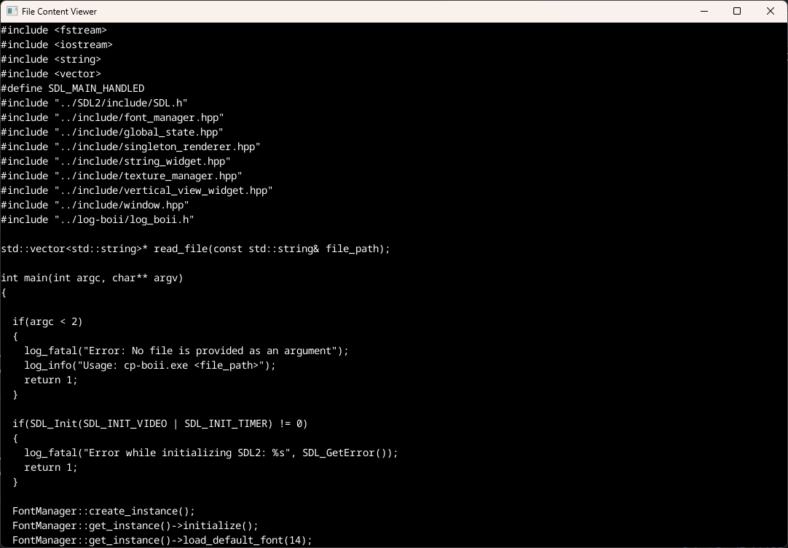

# CP Boii
A super simple, very lightweight, easy to configure code editor.

### Current Status
Made a simple File Viewer with the custom made widgets in SDL2.

Have attached the screenshot of File Viewer viewing it's source code.



### Building
```powershell
> .\scripts\windows\gen_makefiles.bat
> .\scripts\windows\build_release.bat
> cd bin\Release
> cp-boii.exe ..\..\src\file_content_viewer.cpp
```
